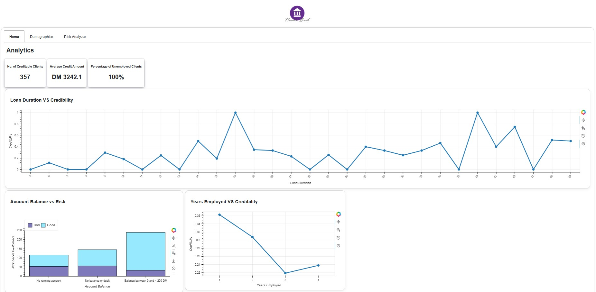

# German Credit Risk Analysis & Loan Decision System
## Project Overview

This project focuses on building a data-driven loan approval system using the German Credit dataset. The goal is to assist financial institutions in making informed lending decisions by minimizing risk and maximizing profitability.

The system combines:

Machine Learning models for credit risk prediction
Interactive dashboards (Panel) for data exploration and decision support

 Reference: Pennsylvania State University STAT 897D course material <br>
Dataset & case study: https://online.stat.psu.edu/stat857/node/215/

## Objectives
Predict whether a loan applicant is a Good or Bad credit risk
Reduce:<br>

* Financial losses from bad loans<br>
* Missed opportunities from rejecting good applicants<br>

Provide an interpretable and interactive dashboard for decision-making.

## Tech Stack
* Languages & Libraries <br>
* Python <br>
* Pandas, NumPy <br>
* Scikit-learn <br>
* Matplotlib, Seaborn <br>
* Bokeh, Holoviews <br>
* Panel <br>


## Project Installtion and Execution
1. Install Python 3.12+
2. Run on terminal or CMD the following command.
```
pip install -r requirements.txt
```
3. Run the command
```
cd app
python main.py
```

 ## Project Overview
